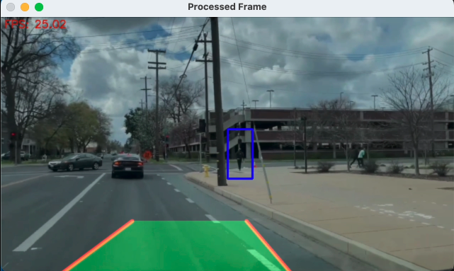
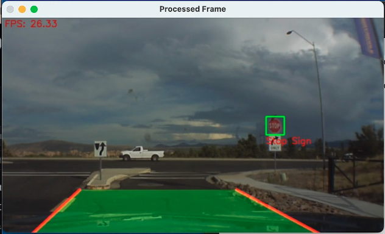
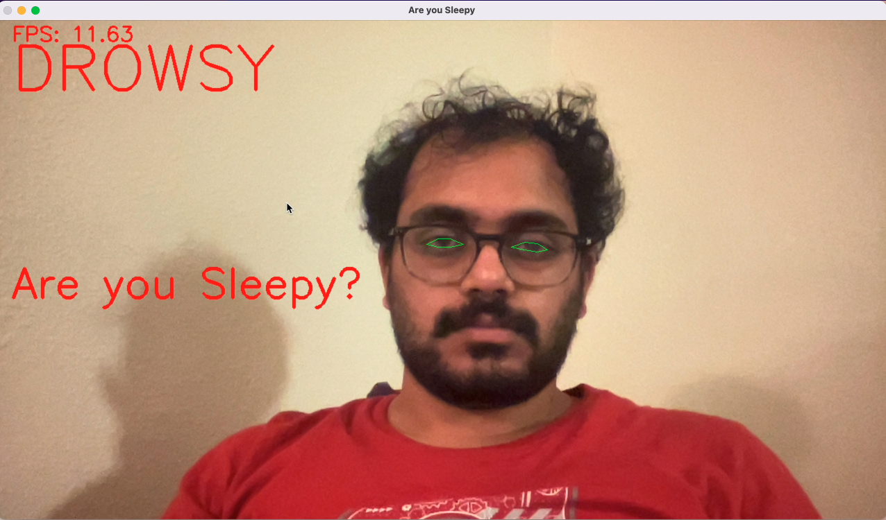

# AutomatedDrivingSystem

A project which uses Computer Vision algorithms to create a possible solution like Automated Driving Systems(ADS) which is used in Autonomous Vehicles(AV).

## Table of Contents
- [Introduction](#introduction)
- [Key Features](#key-features)
- [Project Overview](#project-overview)
- [Technologies Used](#technologies-used)
- [How to Use](#how-to-use)
- [Results and Insights](#results-and-insights)
- [Output Screenshots](#output-screenshots)

## Introduction

These days, no. of accidents have increased. So, the need of automated driving systems is increasing.
This project uses computer vision techniques to detect and provide real-time feedback on lane detection, pedestrian detection, stop sign recognition, and driver drowsiness detection. It can process video input and offer assistance to the driver in various scenarios. 

## Key Features

- Lane Detection
- Pedestrian Detection
- Stop Sign Detection
- Drowsiness Detection

## Project Overview

The project is divided into several phases, including finding the video, finding models, and providing output. It uses some performance improvements like ROI for improving frame rate. For Lane Detection, we have used techniques like 'Canny Edge Detection', 'Hough Line Detection', 'Gaussian Blur', and 'Region Of Interest'. For Pedestrian Detection, we have used 'HaarCascade' algorithm. For Stop sign detection, we have used 'Cascade Classifier'. For Drowsiness detection, we have used 'dlib' library.

## Technologies Used

- Python
- OpenCV
- NumPy
- dlib

## How to Use

1. Clone the repository to your local machine.
2. Install the required Python packages by running: `pip`.
3. Execute the code using the command `python final_code.py`.

## Results and Insights

The project gives insights into the historical stock performance of Amazon, Google, Microsoft, and IBM. It includes predictions that can assist with investment decisions. Please refer to the project's Jupyter notebook and results for more details.

## Output Screenshots

- Lane Detection and Pedestrian Detection

- Lane Detection and Stop Sign Detection

- Drowsiness Detection (Awake)

- Drowsiness Detection (Drowsy)

## Conclusion

In conclusion, the "AutomatedDrivingSystem" project leverages computer vision technologies to enhance road safety and driver assistance. Its features, including lane detection, pedestrian detection, stop sign recognition, and drowsiness detection, contribute to safer driving experiences. Through the use of Python, OpenCV, NumPy, and dlib, the system efficiently processes video input. This project is a significant step toward the development of Automated Driving Systems, addressing the increasing need for enhanced driver assistance and road safety.

